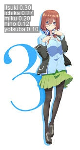

# 프로젝트 개요

- YOLOv8 분류 모델을 활용하여 애니메이션 캐릭터를 분류하는 시스템 구축  
- 입력된 캐릭터 이미지를 분석해 인물 이름 예측  
- 총 5명의 캐릭터: 이치카, 니노, 미쿠, 요츠바, 이츠키  

---

#  데이터셋 구조

- 폴더 구성: `char_dataset/`

```
char_dataset/
├── ichika/
├── nino/
├── miku/
├── yotsuba/
└── itsuki/
```

- 총 이미지 수: 42장  
- YOLO에서 자동으로 80% 학습 / 20% 검증 분할 처리

---

#  설치 및 환경 설정

## 문제 발생

- `pip` 명령어 인식 불가
- YOLO 명령어 인식 안 됨

## 해결 방법

1. 시스템 환경 변수 설정

```
C:\Users\kimjwagyeom\AppData\Local\Programs\Python\Python313  
C:\Users\kimjwagyeom\AppData\Local\Programs\Python\Python313\Scripts
```

2. pip 및 YOLO 설치

```bash
python -m pip install --upgrade pip  
python -m pip install ultralytics
```

---

# 분류 모델 학습

```bash
yolo classify train model=yolov8n-cls.pt data=char_dataset epochs=10 imgsz=224
```

- `model`: YOLOv8n 사전학습 분류 모델  
- `data`: 폴더 이름 기반 클래스 자동 인식  
- `imgsz`: 입력 이미지 크기 224x224  
- `epochs`: 총 10회 반복 학습  

---

# 테스트 및 예측

```bash
yolo classify predict model=runs/classify/train/weights/best.pt source=mikus.jpg
```

- 예측 결과 예시:

```
itsuki 0.30  
ichika 0.27  
miku 0.20  
nino 0.12  
yotsuba 0.10
```

- top-3 정확도 내 실제 정답 포함  
- 결과 이미지 저장 위치: `runs/classify/predict/mikus.jpg`

---

#  예측 이미지 삽입 예시

```html
<p align="center">
  
</p>
```

> Marp는 HTML 이미지 태그도 지원하며 크기 조정 가능

---

#  다중 인물 예측 한계

- 현재 classify는 전체 이미지에서 **하나의 클래스만 예측**
- 다중 인물 포함 시 구분 불가

## 해결책

- **YOLOv8 detect 모델 전환 필요**

---

#  객체 탐지 모델 구성 요소

- `.yaml`: 클래스 정의  
- `.txt`: YOLO 포맷 라벨 (class x y w h)

```text
2 0.52 0.55 0.23 0.45
```

- class: 2 (miku)  
- 중심좌표: (0.52, 0.55)  
- 너비/높이 비율: (0.23, 0.45)

---

#  코드 설명 - 입력 인자 처리

```python
import argparse

parser = argparse.ArgumentParser()
parser.add_argument('-i', '--image', required=True)
parser.add_argument('-m', '--model', default='best.pt')
args = parser.parse_args()
```

- `--image`: 테스트할 이미지  
- `--model`: 사용할 모델 경로  

---

#  코드 설명 - 모델 예측

```python
from ultralytics import YOLO
import cv2, numpy as np

model = YOLO(args.model)
img = cv2.imread(args.image)

if img is None:
    raise FileNotFoundError()

if len(img.shape) == 2 or img.shape[2] == 1:
    img = cv2.cvtColor(img, cv2.COLOR_GRAY2BGR)
```

---

# 상위 3개 클래스 추출

```python
results = model(args.image)
probs = results[0].probs.data
top3_idx = np.argsort(probs)[::-1][:3]
top3 = [(model.names[i], probs[i]) for i in top3_idx]
```

---

# 이미지에 결과 표시 및 저장

```python
for idx, (cls_name, prob) in enumerate(top3):
    label = f"{idx+1}. {cls_name}: {prob:.2f}"
    y = 40 + idx * 40
    cv2.putText(img, label, (20, y), cv2.FONT_HERSHEY_SIMPLEX, 1.1, (0,255,0), 2)

cv2.imwrite("character-classified.jpg", img)
```

---

# 콘솔 출력 및 요약

```python
for rank, (name, p) in enumerate(top3, 1):
    print(f"{rank}. {name} ({p:.2f})")
print(" 결과 저장 완료: character-classified.jpg")
```

---

# 전체 정리

- `YOLOv8 classify`로 단일 인물 분류 성공  
- 다중 인물 처리는 `detect`로 전환해야 가능  
- `.yaml`과 `.txt` 라벨 필요  
- 발표자료는 Marp 마크다운으로 작성 및 PDF 출력 가능  


---

# THANK YOU!

<p align="center">
  
</p>

**질문이 있으신가요?**  
나카노 미쿠. 

> 발표를 들어주셔서 감사합니다.

<style scoped>
section {
  background: linear-gradient(135deg, #1f2022, #2d2e33);
  color: #ffffff;
  text-align: center;
  font-size: 1.9em;
  padding: 2em;
  line-height: 1.6;
}

h1 {
  font-size: 2.5em;
  color: #ffcc00;
  margin-bottom: 0.5em;
}

img {
  margin-top: 1em;
  border-radius: 12px;
  box-shadow: 0 0 20px rgba(255, 255, 255, 0.3);
}
</style>
